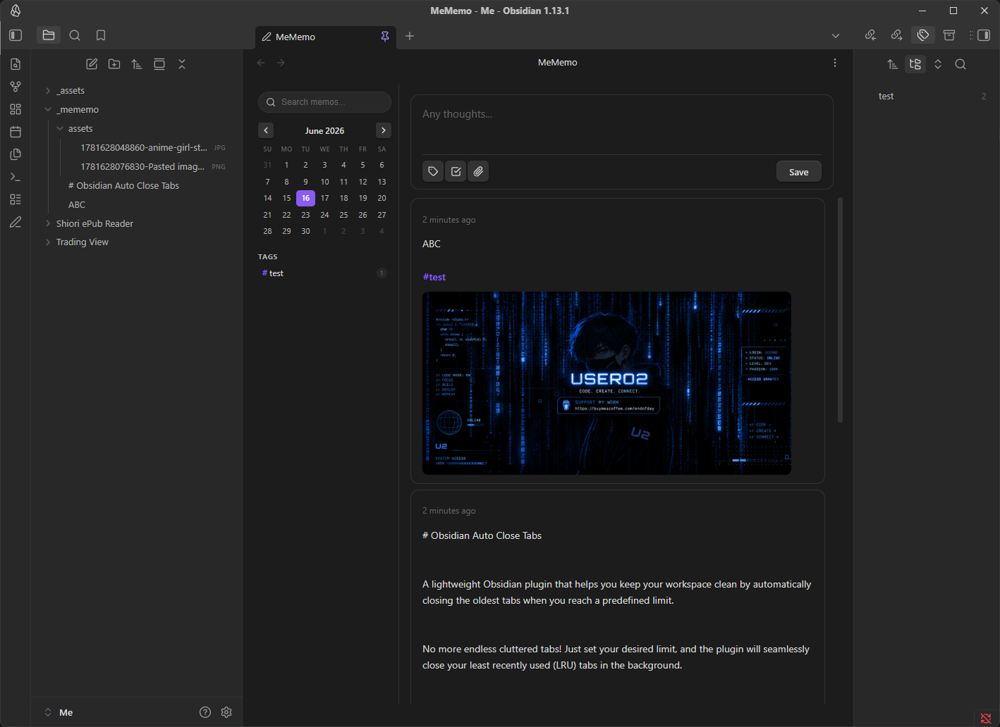

# MeMemo — Quick Capture for Obsidian

> A fast, distraction-free memo plugin for [Obsidian](https://obsidian.md), inspired by the clean interface of [usememos.com](https://usememos.com).

Capture fleeting thoughts, attach files, filter by tags, and keep everything as plain Markdown files inside your vault — no external database, no lock-in.



---

## ✨ Features at a Glance

- **Instant memo capture** with a persistent composer at the top
- **Two-panel layout** — sidebar (calendar + tag filter) + scrollable memo feed
- **Every memo is a `.md` file** stored in `_mememo/` — fully readable without the plugin
- **Drag & drop** OS files or Obsidian vault files directly into the composer
- **Image zoom lightbox** with keyboard navigation
- **Video thumbnails** auto-extracted from the first frame
- **Interactive checkboxes** — check/uncheck and the file updates automatically
- **Include / Exclude tag filtering** with a one-click Reset
- **Auto-open & Pin tab** — configure the plugin to open on startup and stay open

---

## 📦 Installation

### Manual (recommended while unlisted)

1. Download the latest release from the [Releases](../../releases) page.
2. Extract the files (`main.js`, `manifest.json`, `styles.css`) into:
   ```
   <your-vault>/.obsidian/plugins/mememo/
   ```
3. In Obsidian → **Settings → Community plugins** → enable **MeMemo**.

### BRAT (Beta Reviewers Auto-update Tool)

1. Install the [BRAT plugin](https://github.com/TfTHacker/obsidian42-brat).
2. In BRAT settings click **Add Beta plugin** and paste this repo URL.

---

## 🚀 Getting Started

Click the **pencil icon** in the left ribbon, or run the command **Open MeMemo** from the command palette (`Ctrl/Cmd + P`).

The plugin opens in a **new tab** in the main editor area.

---

## 📝 Writing & Saving Memos

### Composer

The text area at the top of the MeMemo tab is always ready for input.

| Action | Result |
|---|---|
| Type anything | Start a new memo |
| `Ctrl + Enter` / `Cmd + Enter` | Save the memo |
| Click **Save** button | Save the memo |

- The **first line** of your memo becomes the filename of the `.md` file (e.g. `_mememo/My memo title.md`). If a file with that name already exists a counter is appended automatically (`My memo title 2.md`, etc.).
- Subsequent lines become the body content.

### Hashtags

Type `#tagname` anywhere in your memo to add a tag. Tags are extracted automatically when saving and stored in the file's YAML frontmatter. They appear in the sidebar for filtering.

```
Just picked up a new book #reading #fiction
```

### Checkboxes / Todo Lists

Use the **checkbox toolbar button** or type manually:

```
- [ ] Buy groceries
- [ ] Call the dentist
- [x] Finish the report
```

Checkboxes are **interactive** in the feed — clicking them toggles the state and updates the `.md` file instantly.

---

## 📎 Attaching Files

### Drag & Drop from your OS

Drag any file from Windows Explorer / Finder and drop it onto the composer. The file is copied into `_mememo/assets/` with a timestamp prefix.

| File type | Preview in composer | Preview in card |
|---|---|---|
| Image (PNG, JPG, GIF, WebP, AVIF, SVG, BMP) | Thumbnail | Full inline image |
| Video (MP4, WebM, MOV, AVI, MKV, M4V, OGV) | Auto-extracted thumbnail + ▶ | Thumbnail + ▶, click to play |
| Audio (MP3, WAV, OGG, M4A, AAC, FLAC) | File chip | File chip |
| Any other file | File chip | File chip |

You can also **paste images from your clipboard** (e.g. screenshots) directly into the composer.

### Drag & Drop from the Obsidian File Navigator

Drag a file from Obsidian's own file tree into the composer. Instead of copying the file, MeMemo inserts a **wikilink**:

| Dragged file | Inserted text |
|---|---|
| Image file | `![[path/to/image.png]]` |
| Note (`.md`) | `[[Note Name]]` |
| Any other vault file | `[[path/to/file.ext]]` |

The composer highlights in **green** while a vault file is being dragged, and **purple** for OS files, so you always know which mode is active.

### Removing a Pending Attachment

Before saving, click the **×** button on any attachment preview in the composer to remove it.

---

## 🖼️ Image Lightbox

Click any image in the memo feed to open a fullscreen lightbox.

| Key / Action | Result |
|---|---|
| `←` / `→` arrow keys | Navigate between images in the same memo |
| `Escape` | Close the lightbox |
| Click outside the image | Close the lightbox |
| Prev / Next buttons | Navigate (shown only when multiple images exist) |
| **N / M** counter pill | Shows current position (hidden for single images) |

---

## 🎬 Video Playback

Dropped video files show an auto-generated thumbnail (extracted from frame 0) with a **▶** overlay.

- Click the thumbnail to open an **inline video player** with native controls and autoplay.
- Press `Escape` or click outside the player to close it.

Supported formats: `.mp4` `.webm` `.mov` `.avi` `.mkv` `.m4v` `.ogv`

---

## 🗂️ Memo Feed

All saved memos appear below the composer, sorted newest-first.

### Card Actions (⋯ menu)

Hover over any card to reveal the **⋯** button in the top-right corner.

| Menu item | Action |
|---|---|
| Open file | Opens the underlying `.md` file in Obsidian |
| Copy text | Copies the memo body to the clipboard |
| Delete | Deletes the `.md` file **and** all its attached asset files |

---

## 🔍 Search

Use the **search bar** at the top of the sidebar to filter memos in real time. The search matches against the memo body text and tag names.

---

## 📅 Calendar

The calendar in the sidebar highlights days that have at least one memo. Click a highlighted date to filter the feed to memos created on that day.

Use the **‹** and **›** arrows to navigate between months.

---

## 🏷️ Tag Filtering

The **Tags** section at the bottom of the sidebar lists every tag found across all memos with a count badge.

Click a tag chip to cycle through three states:

| State | Visual | Effect |
|---|---|---|
| Normal | Default | No filter applied |
| **Include** (1st click) | Green highlight + outline | Feed shows only memos that have this tag |
| **Exclude** (2nd click) | Red highlight + strikethrough | Feed hides all memos that have this tag |
| Clear (3rd click) | Default | Filter removed |

You can combine multiple include and exclude tags at the same time.

Click **Reset** (top-right of the Tags section) to clear all tag filters at once.

---

## ⚙️ Settings

Open **Settings → Community plugins → MeMemo** (gear icon) to configure:

### Open on startup

**Default: On**

Automatically opens the MeMemo tab every time Obsidian starts. Disable this if you prefer to open it manually via the ribbon icon or command palette.

### Pin tab

**Default: Off**

Pins the MeMemo tab so it:
- Cannot be accidentally replaced by another file
- Reopens automatically if you close it during the current session
- Persists across Obsidian restarts (Obsidian saves pinned tabs in workspace state)

> **Tip:** Enable both **Open on startup** and **Pin tab** to make MeMemo always available, no matter what.

---

## 🗃️ File Structure

Everything MeMemo creates lives inside your vault. No external storage, no binary databases.

```
<your-vault>/
└── _mememo/
    ├── My first memo.md          ← one file per memo
    ├── Shopping list.md
    ├── Ideas for the project.md
    └── assets/
        ├── 1718531400123-photo.png    ← attached files
        └── 1718531401234-clip.mp4
```

### Memo file format

```markdown
---
created: "2026-06-16T05:30:00.000Z"
updated: "2026-06-16T05:30:00.000Z"
tags: [reading, fiction]
---

Just picked up a new book #reading #fiction

![[_mememo/assets/1718531400123-cover.jpg]]
```

Because memos are plain Markdown, you can read, edit, search, and back them up with any tool that understands text files.

---

## ⌨️ Keyboard Shortcuts

| Shortcut | Action |
|---|---|
| `Ctrl + Enter` / `Cmd + Enter` | Save the current memo |
| `Escape` | Close image lightbox or video player |
| `←` / `→` | Navigate images in lightbox |

---

## ❤️ Support & Donate

If this plugin has improved your Obsidian workflow, saved you time, or you just want to support its continued development, please consider donating!

Your support is incredibly appreciated, helps fix bugs, and keeps this project alive and growing. 🙏

https://buymeacoffee.com/endofday

<a href="https://www.buymeacoffee.com/endofday" target="_blank"></a>

---

**Built with ❤️ for the Obsidian Community**
